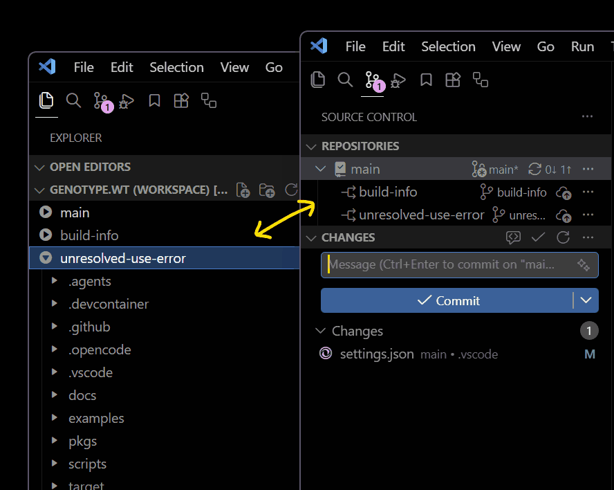

<div align="center">
  

  <h1>Orchardist</h1>

  <h3>Sync VS Code workspace with Git worktrees</h3>
</div>

It watches for Git worktrees in a project and automatically generates a VS Code workspace that includes all of them.

It allows you to work in a single VS Code window with multiple worktrees, without having to open multiple windows or manually manage workspaces.

## Features

### Focusing Worktree

Run **Orchardist: Focus Single Worktree** (`orchardist.focusWorktree`) to select one of the repository's active worktrees and hide the others.

Run **Orchardist: Focus Multiple Worktrees** (`orchardist.focusMultipleWorktrees`) to select several active worktrees using a checkbox menu and hide the others.

Use the status bar menu to change the focused worktree or worktrees, switch between single and multiple focus, or run **Orchardist: Unfocus Worktree** (`orchardist.unfocusWorktree`) to show all worktrees again.

### Opening Worktrees

Run **Orchardist: Open Worktree in New Window** (`orchardist.openWorktreeInNewWindow`) to select an active worktree and open it in a new window.

### Worktree Discriminators

Orchardist assigns a stable symbol to each worktree (🟢🔵..., configurable via [`orchardist.discriminatorSymbols`](#orchardistdiscriminatorsymbols)). It makes VS Code show these symbols in file labels, editor and terminal tabs, and workspace dir names.

Set `orchardist.discriminators` to `true` to enable the feature:

```jsonc
{
  "orchardist.discriminators": true,
}
```

Run **Orchardist: New Terminal** (`orchardist.newTerminal`) to create worktree terminals with tab color uniquely assigned to each worktree.

## Installation

- For Visual Studio Code, [install from VS Code Marketplace](https://marketplace.visualstudio.com/items?itemName=nocorp.orchardist).
- For Cursor, Antigravity, Windsurf, etc., [install from Open VSX Registry](https://open-vsx.org/extension/nocorp/orchardist).

## Configuration

### `orchardist.enabled`

Defaults to `true`. Set to `false` to disable the extension.

### `orchardist.alwaysBootstrap`

Defaults to `false`. Set to `true` to automatically bootstrap a workspace regardless of whether a repository has worktrees.

### `orchardist.mainName`

Defaults to `main`. Set the main workspace name.

### `orchardist.workspaceFileName`

Defaults to `${workspaceFolderBasename}.wt.code-workspace`. Set the workspace filename to customize the workspace name displayed by VS Code. The `${workspaceFolderBasename}` variable expands to the main worktree directory name.

### `orchardist.ignoreWorkspaceFile`

Defaults to `true`. Set to `false` to stop the extension from automatically adding the workspace file to `.gitignore`.

### `orchardist.discriminators`

Defaults to `false`. Set to `true` to show worktree symbols in file labels, editor and terminal tabs, and workspace dir names.

See [Worktree Discriminators](#worktree-discriminators) for details.

### `orchardist.discriminatorSymbols`

Defaults to `["🟢", "🔵", "🟣", "🟡", "🔴", "⚪️", "🟠", "🟤", "⚫️"]`. Set an ordered array of strings to use as the discriminator symbols for the worktrees.

See [Worktree Discriminators](#worktree-discriminators) for details.

## Shell Integration

Shell integration exposes the current worktree's normalized name as `ORCHARDIST_WORKTREE_NAME` and assigned symbol as `ORCHARDIST_WORKTREE_SYMBOL`.

These variables update when the current directory changes and can be used in shell prompts such as [Starship](https://starship.rs/).

> They are available regardless of the `orchardist.discriminators` setting.

### Bash

Add this snippet to your `~/.bashrc`:

<details>
  <summary>Show <code>orchardist.bash</code></summary>

```bash
__orchardist_parse_discriminators() {
  __orchardist_paths=()
  __orchardist_names=()
  __orchardist_symbols=()
  __orchardist_parsed_discriminators=${ORCHARDIST_DISCRIMINATORS-}
  [ -n "$__orchardist_parsed_discriminators" ] || return 1

  local path name symbol rest=$__orchardist_parsed_discriminators
  while [ -n "$rest" ]; do
    path=${rest%%;*}; rest=${rest#*;}
    name=${rest%%;*}; rest=${rest#*;}
    symbol=${rest%%;*}; rest=${rest#*;}
    if [ -n "$path" ] && [ -n "$symbol" ]; then
      __orchardist_paths+=("$path")
      __orchardist_names+=("$name")
      __orchardist_symbols+=("$symbol")
    fi
  done
}

__orchardist_on_pwd() {
  [ -n "${ORCHARDIST_DISCRIMINATORS-}" ] || return
  if [ "${__orchardist_parsed_discriminators-}" != "$ORCHARDIST_DISCRIMINATORS" ]; then
    __orchardist_parse_discriminators || return
  fi

  local best=-1 best_length=0 index path
  for index in "${!__orchardist_paths[@]}"; do
    path=${__orchardist_paths[$index]}
    if { [ "$PWD" = "$path" ] || [[ "$PWD" == "$path/"* ]]; } &&
      [ "${#path}" -gt "$best_length" ]; then
      best=$index
      best_length=${#path}
    fi
  done

  if [ "$best" -ge 0 ]; then
    export ORCHARDIST_WORKTREE_NAME=${__orchardist_names[$best]}
    export ORCHARDIST_WORKTREE_SYMBOL=${__orchardist_symbols[$best]}
  else
    unset ORCHARDIST_WORKTREE_NAME ORCHARDIST_WORKTREE_SYMBOL
  fi
}

case ";${PROMPT_COMMAND-};" in
  *";__orchardist_on_pwd;"*) ;;
  *) PROMPT_COMMAND="${PROMPT_COMMAND:+$PROMPT_COMMAND;}__orchardist_on_pwd" ;;
esac
__orchardist_on_pwd
```

</details>

### Zsh

Add this snippet to your `~/.zshrc`:

<details>
  <summary>Show <code>orchardist.zsh</code></summary>

```zsh
autoload -Uz add-zsh-hook

__orchardist_parse_discriminators() {
  typeset -ga __orchardist_paths __orchardist_names __orchardist_symbols
  __orchardist_paths=()
  __orchardist_names=()
  __orchardist_symbols=()
  __orchardist_parsed_discriminators=${ORCHARDIST_DISCRIMINATORS-}
  [[ -n $__orchardist_parsed_discriminators ]] || return 1

  local -a parts
  parts=("${(@s:;:)__orchardist_parsed_discriminators}")
  local index
  for ((index = 1; index + 2 <= ${#parts}; index += 3)); do
    if [[ -n ${parts[index]} && -n ${parts[index + 2]} ]]; then
      __orchardist_paths+=("${parts[index]}")
      __orchardist_names+=("${parts[index + 1]}")
      __orchardist_symbols+=("${parts[index + 2]}")
    fi
  done
}

__orchardist_on_pwd() {
  [[ -n ${ORCHARDIST_DISCRIMINATORS-} ]] || return
  if [[ ${__orchardist_parsed_discriminators-} != $ORCHARDIST_DISCRIMINATORS ]]; then
    __orchardist_parse_discriminators || return
  fi

  local best=0 best_length=0 index path
  for ((index = 1; index <= ${#__orchardist_paths}; index++)); do
    path=${__orchardist_paths[index]}
    if [[ ($PWD == $path || $PWD == "$path"/*) && ${#path} -gt $best_length ]]; then
      best=$index
      best_length=${#path}
    fi
  done

  if ((best > 0)); then
    export ORCHARDIST_WORKTREE_NAME=${__orchardist_names[best]}
    export ORCHARDIST_WORKTREE_SYMBOL=${__orchardist_symbols[best]}
  else
    unset ORCHARDIST_WORKTREE_NAME ORCHARDIST_WORKTREE_SYMBOL
  fi
}

add-zsh-hook chpwd __orchardist_on_pwd
add-zsh-hook precmd __orchardist_on_pwd
__orchardist_on_pwd
```

</details>

### Fish

Add this snippet to your `~/.config/fish/conf.d/orchardist.fish` (or copy-paste into `~/.config/fish/config.fish`):

<details>
  <summary>Show <code>orchardist.fish</code></summary>

```fish
function __orchardist_parse_discriminators
    set -eg __orchardist_paths __orchardist_names __orchardist_symbols
    set -g __orchardist_parsed_discriminators "$ORCHARDIST_DISCRIMINATORS"
    test -n "$__orchardist_parsed_discriminators"; or return 1

    set -l parts (string split -n ';' -- $__orchardist_parsed_discriminators)
    set -l index 1
    while test (math $index + 2) -le (count $parts)
        set -l path $parts[$index]
        set -l name $parts[(math $index + 1)]
        set -l symbol $parts[(math $index + 2)]
        if test -n "$path" -a -n "$symbol"
            set -ag __orchardist_paths $path
            set -ag __orchardist_names $name
            set -ag __orchardist_symbols $symbol
        end
        set index (math $index + 3)
    end
end

function __orchardist_match --argument-names dir
    set -q ORCHARDIST_DISCRIMINATORS; or return 1
    if not set -q __orchardist_parsed_discriminators
        __orchardist_parse_discriminators; or return 1
    else if test "$__orchardist_parsed_discriminators" != "$ORCHARDIST_DISCRIMINATORS"
        __orchardist_parse_discriminators; or return 1
    end

    set -l best 0
    set -l best_length 0
    set -l index 1
    for path in $__orchardist_paths
        if test "$dir" = "$path"; or string match -q -- "$path/*" "$dir"
            set -l length (string length -- $path)
            if test $length -gt $best_length
                set best $index
                set best_length $length
            end
        end
        set index (math $index + 1)
    end

    if test $best -gt 0
        echo $best
        return 0
    end
    return 1
end

function __orchardist_on_pwd --on-variable PWD
    status is-interactive; or return
    set -l match (__orchardist_match "$PWD")
    if test $status -eq 0
        set -gx ORCHARDIST_WORKTREE_NAME $__orchardist_names[$match]
        set -gx ORCHARDIST_WORKTREE_SYMBOL $__orchardist_symbols[$match]
    else
        set -e ORCHARDIST_WORKTREE_NAME ORCHARDIST_WORKTREE_SYMBOL
    end
end

status is-interactive
and set -q ORCHARDIST_DISCRIMINATORS
and __orchardist_on_pwd
```

</details>

### Starship

Add both variables to your Starship prompt by including the modules in `format` and configuring them in `~/.config/starship.toml`:

```toml
format = "$env_var.ORCHARDIST_WORKTREE_SYMBOL$env_var.ORCHARDIST_WORKTREE_NAME$all"

[env_var.ORCHARDIST_WORKTREE_SYMBOL]
format = "[$env_value ]($style)"
style = "bold"

[env_var.ORCHARDIST_WORKTREE_NAME]
format = "[$env_value ]($style)"
style = "bold cyan"
```

## Changelog

See [the changelog](./CHANGELOG.md).

## License

[MIT © Sasha Koss](https://koss.nocorp.me/mit/)
